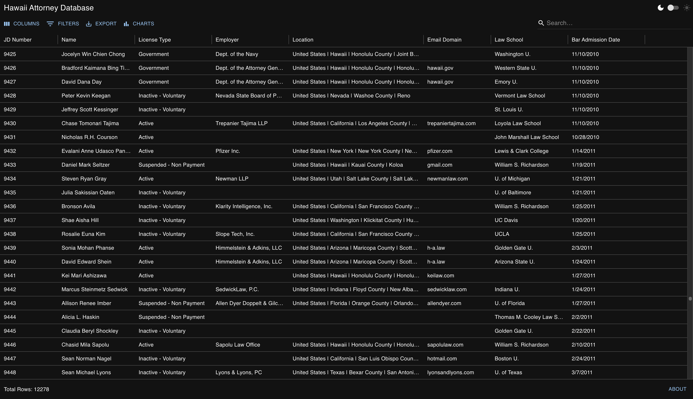
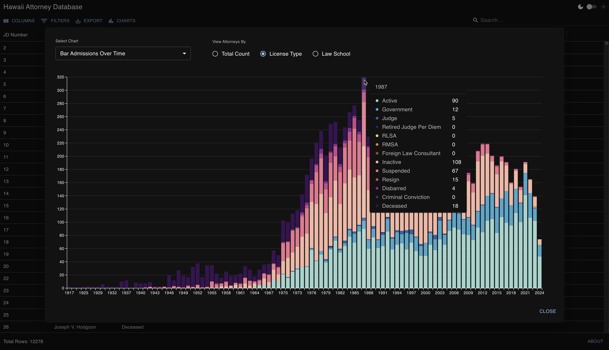

# Hawaii Attorney Database – Frontend

A web application that provides a searchable, filterable, and exportable database of attorneys licensed in Hawaii.



The application also includes interactive data visualizations to provide additional insights.



## Prerequisites

- Node.js (version 14 or later recommended)
- yarn

## Installation

1. Clone the repository:

   ```
   git clone git@github.com:bronsonavila/hawaii-attorney-database-frontend.git
   cd hawaii-attorney-database-frontend
   ```

2. Install dependencies:
   ```
   yarn install
   ```

## Development

To run the development server:

```
yarn dev
```

This will start the development server, typically at `http://localhost:5173`.

## Building for Production

To create a production build:

```
yarn build
```

The built files will be in the `dist` directory.

## Testing

The project uses Vitest and React Testing Library for testing. The test suite covers component rendering, data validation, and utility functions. Test scripts can be found in the `package.json` file.

## Deployment

The application is deployed using Netlify with continuous deployment from the `main` branch. Build settings are configured in `netlify.toml`.

## Data Source

The attorney data is obtained from the [Hawaii State Bar Association's Member Directory](https://hsba.org/HSBA_2020/For_the_Public/Find_a_Lawyer/HSBA_2020/Public/Find_a_Lawyer.aspx). It is scraped and processed using a custom Node.js application from a [private backend repository](https://github.com/bronsonavila/hawaii-attorney-database-backend) and stored in a CSV file (`public/hsba-member-records.csv`), which the application loads at runtime.

## HSBA Active Attorneys - Age Map

The app includes an interactive Leaflet map for visualizing Hawaii attorney age distribution and retirement-risk concentration. The main component is `src/components/maps/AttorneyAgeMap.tsx`.

The map supports:

- `ZIP Code` and `Judicial District` geography levels.
- `Choropleth` and `Bubble Map` views.
- Retirement-risk buckets based on the percent of active attorneys age 60+: `< 25%`, `25-49%`, `50-74%`, and `75%+`.
- Bubble sizes based on the absolute number of attorneys age 60+.
- No fill, hover state, tooltip, or bubble for areas with zero active attorneys.
- Monospace tooltips with locality labels for ZIPs, active attorney counts, attorneys age 60+, and aligned age-bracket counts.

The map intentionally uses a grayscale, low-opacity Carto base layer so the retirement-risk colors and district or ZIP boundaries remain readable.

### Map Data Files

Source files:

- `logs/member-statistics-with-age.csv`: active attorney age and ZIP data from the backend workflow.
- `public/hawaii-zcta.geojson`: Hawaii ZIP Code Tabulation Area geometry.
- `public/Judicial_Districts.geojson`: source judicial district geometry.
- `logs/zip-region-audit.json`: cached Google Geocoding results used for ZIP locality and neighborhood labels.

Generated files:

- `public/hawaii-attorney-by-zip.json`: attorney counts, age brackets, retirement-risk percentages, ZIP centroids, and ZIP locality labels.
- `public/hawaii-judicial-districts.geojson`: normalized judicial district GeoJSON used by the frontend.
- `public/hawaii-attorney-by-district.json`: district-level attorney counts, age brackets, retirement-risk percentages, ZIP membership, and bubble anchors.
- `dist-standalone/standalone.html`: single-file standalone map build.

### Map Data Workflow

After changing `logs/member-statistics-with-age.csv` or map generation logic, regenerate the ZIP data first:

```
node scripts/generate-hawaii-attorney-by-zip.mjs
```

Then regenerate judicial district data:

```
yarn run generate:district
```

Then rebuild the standalone HTML:

```
yarn run build:standalone
```

If ZIP locality or neighborhood labels need to be refreshed, set `GOOGLE_GEOCODING_API_KEY` and run:

```
GOOGLE_GEOCODING_API_KEY=your_key_here yarn run refresh:zip-localities
```

The locality refresher reads `public/hawaii-attorney-by-zip.json` to know which ZIPs exist and writes `logs/zip-region-audit.json` plus `logs/zip-region-audit.txt`. After refreshing localities, run the ZIP generator again so the locality labels are folded back into `public/hawaii-attorney-by-zip.json`, then run the district generator and standalone build.

### District Bubble Anchors

Judicial district bubbles should not use the raw polygon centroid. Some districts are large, concave, or cover substantial low-density land, so a geometric center can look wrong.

`scripts/generate-hawaii-attorney-by-district.mjs` chooses district bubble anchors in this order:

1. ZIP-centroid average weighted by attorneys age 60+.
2. ZIP-centroid average weighted by active attorney count.
3. Heaviest ZIP centroid inside the district, weighted by attorneys age 60+.
4. Heaviest ZIP centroid inside the district, weighted by active attorney count.
5. Polygon `centerOfMass`, falling back to `pointOnFeature`.

The generator verifies candidate points stay inside the district polygon before using them. This keeps bubbles visually tied to where attorneys actually are while avoiding invalid marker placement outside a district.

### Standalone Map

The standalone build is driven by:

- `standalone.html`
- `src/standalone.tsx`
- `vite.standalone.config.ts`
- `src/utils/maps/standaloneMapData.ts`

`vite-plugin-singlefile` inlines the application into `dist-standalone/standalone.html`. The standalone config sets `import.meta.env.VITE_STANDALONE` to `true`, which makes `AttorneyAgeMap` load bundled JSON and GeoJSON from `standaloneMapData.ts` instead of fetching from `/public`.

To view the standalone map locally after building, open:

```
dist-standalone/standalone.html
```

### Implementation Notes

- The project uses React 18, so `react-leaflet` is pinned to `4.2.1`.
- The map initializes at zoom level `8`.
- Bubble tooltips are anchored to the bubble, but hovering either the bubble or the underlying zone activates the tooltip.
- Dragging the map closes open tooltips and temporarily disables interactive layer pointer events to avoid stuck or duplicated tooltips.
- ZIP labels are stored from Google Geocoding `locality`, falling back to `neighborhood` during ZIP generation. The component falls back to `ZIP: XXXXX` only if neither label is available.
