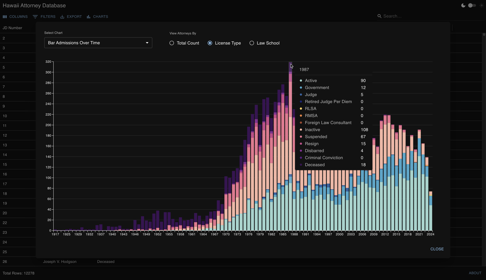

# Hawaii Attorney Database – Frontend

A web application that provides a searchable, filterable, and exportable database of attorneys licensed in Hawaii.


The application also includes interactive data visualizations to provide additional insights.



## Prerequisites

- Node.js (version 14 or later recommended)
- yarn

## Installation

1. Clone the repository:

   ```
   git clone git@github.com:bronsonavila/hawaii-attorney-database-frontend.git
   cd hawaii-attorney-database-frontend
   ```

2. Install dependencies:
   ```
   yarn install
   ```

## Development

To run the development server:

```
yarn dev
```

This will start the development server, typically at `http://localhost:5173`.

## Building for Production

To create a production build:

```
yarn build
```

The built files will be in the `dist` directory.

## Testing

The project uses Vitest and React Testing Library for testing. The test suite covers component rendering, data validation, and utility functions. Test scripts can be found in the `package.json` file.

## Deployment

The application is deployed using Netlify with continuous deployment from the `main` branch. Build settings are configured in `netlify.toml`.

## Data Source

The attorney data is obtained from the [Hawaii State Bar Association's Member Directory](https://hsba.org/HSBA_2020/For_the_Public/Find_a_Lawyer/HSBA_2020/Public/Find_a_Lawyer.aspx). It is scraped and processed using a custom Node.js application from a [private backend repository](https://github.com/bronsonavila/hawaii-attorney-database-backend) and stored in a CSV file (`public/hsba-member-records.csv`), which the application loads at runtime.
